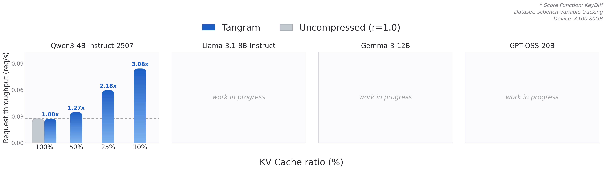
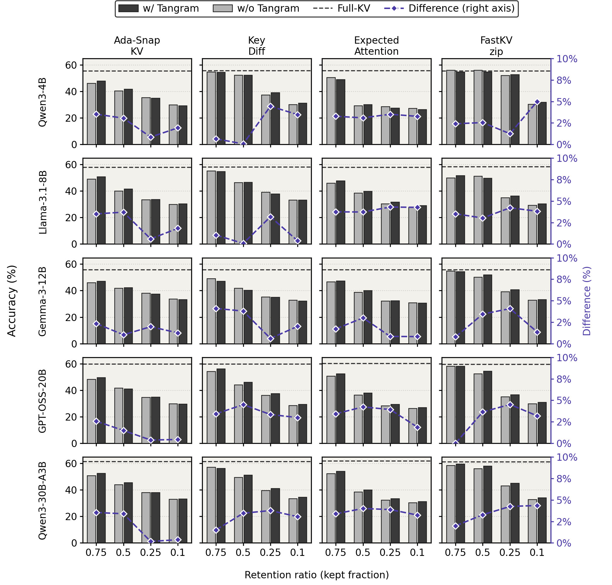

# KeyDiff use case

Source: [`vllm/v1/attention/compression/keydiff.py`](../../vllm/v1/attention/compression/keydiff.py) ·
Paper: [arXiv:2504.15364](https://arxiv.org/abs/2504.15364)

## Speedup

<p align="center">
  
</p>

## Accuracy

KeyDiff is the second column.

<p align="center">
  
</p>

## How to run

Speedup:

```bash
cd benchmarks/tangram/speedup
SCORERS=keydiff RATIOS="1.0 0.5 0.25 0.1" ./run_speedup.sh
```

SCBench accuracy:

```bash
cd benchmarks/tangram
SCORER=keydiff LEVEL=perlayer_cluster DATASET=mid RATIOS="1.0 0.5 0.25 0.1" \
bash benchmark_scbench.sh
```

Override `MODEL=` for another model.
